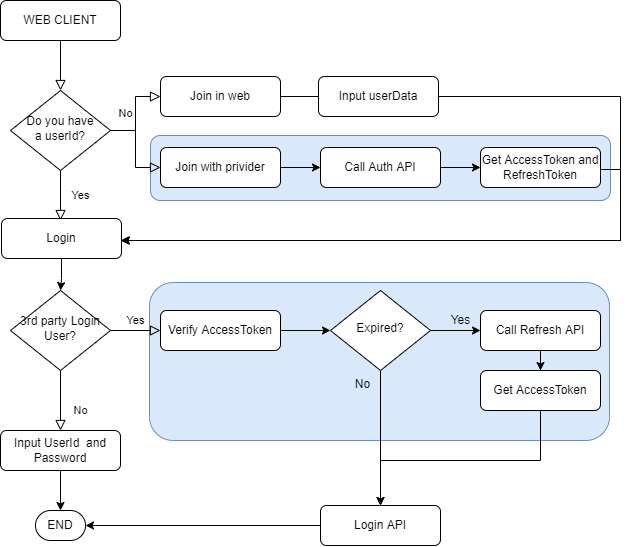

# 3rd-party-login
- updated : 08/20

## Summary
- integrating 3rd party (Naver, kakao, Facebook, Google) login
- build server and db
- Schedule : ~ 09/30

|WEEKS|DATE|WORK|JUN|RONG|
|------|---|---|----|----|
|1 Week|08/19~08/21|Prepare | Setting dev env and design architecture| Setting dev env and design architecture |
|2 Week|08/22~08/28|DEV | Server | DB|
|3 Week|08/29~09/04|DEV | Server | Admin + DB |
|4 Week|09/05~09/11(추석)|DEV | implementation auth API|implementation auth API|
|5 Week|09/12~09/18|DEV|implementation auth API|implementation auth API|
|6 Week|09/19~09/25|DEV (for a schedule delay)| - | - |
|7 Week|09/26~09/30|Verification|||

## Dev Environment
- Spring boot 2.7.3
  - maven
  - mvc2
- redis
  - Spring Data Redis
  - TBD

## Function
- Login : auth of Naver, kakao, Facebook, Google and developed login api
- Join : developed join form
- Web : Login and join page.  Admin page (manage login history and user list)

### Checking
|No|Category|Decision|
|------|---|---|
|1|UserId| create a UserId after Joining|
|2|developed login api| ? need planning (young part)|
|3|fixing provider name |- NV : Naver  - KK : Kakao  - GG : Google  - FB : Facebook  - MA : Making Login API   |
|4|Log| Join and Login log  support? or not? |
|-|||

## Architecture
### Sequence Diagram

### FlowChart

### Sever
- call login api and varify user's provider token  

### Client (admin)
- for mvc
- login admin account > display DB (Simplification)

### DB
- Redis : User info, Log db

## Reference 
Naver auth : https://developers.naver.com/docs/login/api/api.md  
kakao auth : https://developers.kakao.com/docs/latest/ko/kakaologin/common  
Facebook auth : https://developers.facebook.com/docs/facebook-login/overview  
Google auth : https://developers.google.com/identity/sign-in/web/sign-in  
